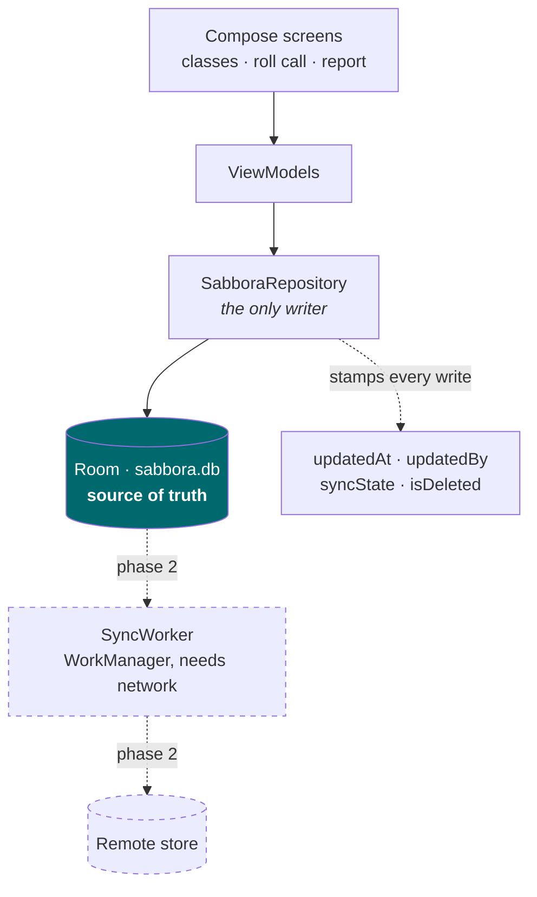

# سبّورة · Sabbora

[](https://github.com/ahmed-r-z-adwan/sabbora/actions/workflows/tests.yml)

An Android app for teachers at learning points where the network comes and goes and the register is still kept on paper. Attendance, marks and reports, all of it usable with the phone in aeroplane mode.

> **Status: phase 1 of 4 — the local app.** Classes, students, roll call and the class report work today, entirely offline. The sync layer is designed and its metadata is already written on every record, but the worker that talks to a server is not built yet. See [Roadmap](#roadmap).

## The problem

At a learning point the register lives in a notebook. Three things follow from that: the notebook is the only copy, a teacher covering a class cannot see what the regular teacher recorded, and a term's attendance has to be totalled by hand.

Putting it online is the obvious answer and the wrong one. The connection is not reliable enough to be in the path of taking a register. A teacher cannot be told to wait for a spinner with thirty students standing in front of them.

So the network is not in that path. Every action writes to the device and returns immediately. Sync is something that happens later, to data that is already safe.

## Architecture



Room is the source of truth, not a cache. Nothing in the UI ever waits on a network call, because there is no path from a tap to the network.

### Four decisions that make sync possible later

These are in the schema from the first commit, because retrofitting any of them onto existing rows is a migration nobody enjoys.

| Field | Why it exists |
|---|---|
| `id` — a UUID minted on the device | Two teachers adding students offline must not collide. A server-assigned or auto-increment id cannot be handed out while offline. |
| `updatedAt` — epoch millis | The ordering that resolves conflicts under last-write-wins. |
| `updatedBy` — random per-install id | Lets a conflict be described as "this device against that one" rather than "something changed". No device name, no account. |
| `syncState` — `PENDING` / `SYNCED` | A record is `PENDING` from the moment it is written. A changed row that still says `SYNCED` is invisible to the sync worker, which is silent data loss. |
| `isDeleted` — soft delete | A deletion has to travel to the other devices like any other change, so rows are marked, never removed. |

### What an attendance rate means here

Two policy decisions are encoded in `AttendanceRate`, and both are pinned by tests:

- **A late student attended.** Lateness is a punctuality problem, not an absence.
- **An excused absence is removed from the denominator**, not counted against the student. A pupil with a medical note is not penalised for having one.

A student with no marked days has **no rate** — the app prints an em dash rather than `0%`, which would read as perfect absence.

## Running it

Android Studio, or:

```bash
./gradlew assembleDebug
```

Needs JDK 17+ and an Android SDK with platform 36. Put the SDK path in `local.properties` as `sdk.dir=...`.

```bash
./gradlew testDebugUnitTest
```

## Privacy

The people in this database are mostly children. The schema holds a name and an optional teacher's note, and nothing else — no phone number, no address, no guardian details. The per-install id is a random UUID and is excluded from cloud backup, so a restore cannot give two installations the same identity.

Before this is used with a real learning point, the responsible body has to agree to it and the server rules have to be written first, not after.

## Roadmap

| Phase | What |
|---|---|
| **1 — local app** ✅ | Room schema with sync metadata, classes, students, roll call, class report, unit tests |
| 2 — sync | `SyncWorker` on WorkManager, network-constrained with backoff; upload pending, download changes |
| 3 — conflicts | Last-write-wins on `updatedAt` first, documented; then field-level merge if time allows |
| 4 — measurement | Sync success rate, time to converge after reconnect, and bytes moved when sending deltas against sending everything. Written up in `docs/`. |

## Built with

Kotlin · Jetpack Compose · Material 3 · Room · Navigation Compose · KSP

---

The interface is Arabic first, with English as the fallback locale, because the teachers this is for are.
